# Session 12

#### Pytorch Lightning: SYSTEM VS MODEL

A `lightning module` defines a *system* not just a model.

[](https://pl-bolts-doc-images.s3.us-east-2.amazonaws.com/pl_docs/model_system.png)


#### Training vs Forward in Pytorch Lightning:

**FORWARD vs TRAINING_STEP**

In Lightning the authors suggest separating training from inference. The `training_step` defines the full training loop. They encourage users to use the `forward` to define inference actions.

For example, in this case we can define the autoencoder to act as an embedding extractor:

```
def forward(self, batch):
    embeddings = self.encoder(batch)
    return embeddings
```


Of course, nothing is preventing you from using `forward` from within the `training_step`.

```
def training_step(self, batch, batch_idx):
    ...
    embeddings = self.encoder(batch)
    output = self.decoder(embeddings)
```


It really comes down to your application. **They (authors) do, *however*, recommend that you keep both intents separate**.

- Use `forward` for inference (predicting).

- Use `training_step` for training.

  

#### HOW TO ORGANIZE PYTORCH INTO LIGHTNING: [Source: offical docs](https://pytorch-lightning.readthedocs.io/en/1.6.0/starter/converting.html)

1. ##### Move the computational code:

   Move the model architecture and forward pass to your `LightningModule`.

   ```python
   import pytorch_lightning as pl
   import torch
   import torch.nn as nn
   import torch.nn.functional as F
   
   
   class LitModel(pl.LightningModule):
       def __init__(self):
           super().__init__()
           self.layer_1 = nn.Linear(28 * 28, 128)
           self.layer_2 = nn.Linear(128, 10)
   
       def forward(self, x):
           x = x.view(x.size(0), -1)
           x = self.layer_1(x)
           x = F.relu(x)
           x = self.layer_2(x)
           return x
   ```

   

2. ##### Move the Optimizer(s) and LR Scheduler(s):

   Move your optimizers to the `configure_optimizers()` hook.

​		

```python
class LitModel(pl.LightningModule):
    def configure_optimizers(self):
        optimizer = torch.optim.Adam(self.parameters(), lr=1e-3)
        lr_scheduler = torch.optim.lr_scheduler.StepLR(optimizer, step_size=1)
        return [optimizer], [lr_scheduler]
```


3. ##### Configure the Training Logic:

   *Lightning automates the training loop for you and manages all of the associated components such as*: epoch and batch tracking, optimizers and schedulers, and metric reduction. As a user, you just need to define how your model behaves with a batch of training data within the `training_step()` method. When using Lightning, simply override the `training_step()` method which takes the current `batch` and the `batch_idx` as arguments. **Optionally**, it can take `optimizer_idx` if your LightningModule defines multiple optimizers within its `configure_optimizers()` hook.

   

```python
class LitModel(pl.LightningModule):
    def training_step(self, batch, batch_idx):
        x, y = batch
        y_hat = self(x)
        loss = F.cross_entropy(y_hat, y)
        return loss
```


4. ##### Configure the Validation Logic

Lightning also automates the validation loop for you and manages all of the associated components such as: epoch and batch tracking, and metrics reduction. As a user, you just need to define how your model behaves with a batch of validation data within the `validation_step()` method. When using Lightning, simply override the `validation_step()` method which takes the current `batch` and the `batch_idx` as arguments. Optionally, it can take `dataloader_idx` if you configure multiple dataloaders.


```python
class LitModel(pl.LightningModule):
    def validation_step(self, batch, batch_idx):
        x, y = batch
        y_hat = self(x)
        val_loss = F.cross_entropy(y_hat, y)
        self.log("val_loss", val_loss)
```

NOTE

`model.eval()` and `torch.no_grad()` are called automatically for validation.

`trainer.validate()` loads the best checkpoint automatically by default if checkpointing was enabled during fitting.


5. ##### Configure Testing Logic

As a user, you just need to define how your model behaves with a batch of testing data within the `test_step()` method. When using Lightning, simply override the `test_step()` method which takes the current `batch` and the `batch_idx` as arguments. Optionally, it can take `dataloader_idx` if you configure multiple dataloaders.

```python
class LitModel(pl.LightningModule):
    def test_step(self, batch, batch_idx):
        x, y = batch
        y_hat = self(x)
        test_loss = F.cross_entropy(y_hat, y)
        self.log("test_loss", test_loss)
```


The test loop isn’t used within `fit()`, therefore, you would need to explicitly call `test()`.

```python
model = LitModel()
trainer.test(model)
```

NOTE

`model.eval()` and `torch.no_grad()` are called automatically for testing.

`trainer.test()` loads the best checkpoint automatically by default if checkpointing is enabled.


6. ##### Configure Prediction Logic:

Lightning automates the prediction loop for you and manages all of the associated components.

**If you don’t override `predict_step` hook, it by default calls `forward()` method on the batch**.

```python
class LitModel(LightningModule):
    def predict_step(self, batch, batch_idx):
        x, y = batch
        pred = self(x)
        return pred
```


The predict loop will not be used until you call `predict()`.

```python
model = LitModel()
trainer.predict(model)
```


7. ##### Remove any .cuda() or .to(device) Calls:

   Lightning makes sure that the data coming from `DataLoader` and all the `Module` instances initialized inside `LightningModule.__init__` are moved to the respective devices automatically.

   If you still need to access the current device, you can use `self.device` anywhere in your `LightningModule` **except** in the `__init__` and `setup` methods.

   

8. ##### Use your own data

To use your DataLoaders, you **can** override the respective dataloader hooks in the `LightningModule`. ***Alternatively***, you can **pass in the dataloaders explictly inside `trainer.fit/.validate/.test/.predict` calls.**

```python
class LitModel(LightningModule):
    def train_dataloader(self):
        return DataLoader(...)

    def val_dataloader(self):
        return DataLoader(...)

    def test_dataloader(self):
        return DataLoader(...)

    def predict_dataloader(self):
        return DataLoader(...)
```


----


## Logging from a LightningModule

Lightning offers automatic log functionalities for logging scalars, or manual logging for anything else. [Source: offical docs](https://lightning.ai/docs/pytorch/stable/extensions/logging.html#logging)

### Automatic Logging

Use the `log()` or `log_dict()` methods to log from anywhere in a [LightningModule](https://lightning.ai/docs/pytorch/stable/common/lightning_module.html) and [callbacks](https://lightning.ai/docs/pytorch/stable/extensions/callbacks.html).

```python
def training_step(self, batch, batch_idx):
    self.log("my_metric", x)


# or a dict to log all metrics at once with individual plots
def training_step(self, batch, batch_idx):
    self.log_dict({"acc": acc, "recall": recall})
```


Depending on where the `log()` method is called, Lightning auto-determines the correct logging mode for you. Of course you can override the default behavior by manually setting the `log()` parameters.

```python
def training_step(self, batch, batch_idx):
    self.log("my_loss", loss, on_step=True, on_epoch=True, prog_bar=True, logger=True)
```


The `log()` method has a few options:

- `on_step`: Logs the metric at the current step.
- `on_epoch`: Automatically accumulates and logs at the end of the epoch.
- `prog_bar`: Logs to the progress bar (Default: `False`).
- `logger`: Logs to the logger like `Tensorboard`, or any other custom logger passed to the [`Trainer`](https://lightning.ai/docs/pytorch/stable/api/lightning.pytorch.trainer.trainer.Trainer.html#lightning.pytorch.trainer.trainer.Trainer) (Default: `True`).
- `reduce_fx`: Reduction function over step values for end of epoch. Uses `torch.mean()` by default and is not applied when a [`torchmetrics.Metric`](https://torchmetrics.readthedocs.io/en/stable/pages/implement.html#torchmetrics.Metric) is logged.
- `enable_graph`: If True, will not auto detach the graph.
- `sync_dist`: If True, reduces the metric across devices. Use with care as this may lead to a significant communication overhead.
- `sync_dist_group`: The DDP group to sync across.
- `add_dataloader_idx`: If True, appends the index of the current dataloader to the name (when using multiple dataloaders). If False, user needs to give unique names for each dataloader to not mix the values.
- `batch_size`: Current batch size used for accumulating logs logged with `on_epoch=True`. This will be directly inferred from the loaded batch, but for some data structures you might need to explicitly provide it.
- `rank_zero_only`: Whether the value will be logged only on rank 0. This will prevent synchronization which would produce a deadlock as not all processes would perform this log call.

| Hook                                                         | on_step | on_epoch |
| ------------------------------------------------------------ | ------- | -------- |
| on_train_start, on_train_epoch_start, on_train_epoch_end     | False   | True     |
| on_before_backward, on_after_backward, on_before_optimizer_step, on_before_zero_grad | True    | False    |
| on_train_batch_start, on_train_batch_end, training_step      | True    | False    |
| on_validation_start, on_validation_epoch_start, on_validation_epoch_end | False   | True     |
| on_validation_batch_start, on_validation_batch_end, validation_step | False   | True     |

NOTE

While logging tensor metrics with `on_epoch=True` inside step-level hooks and using mean-reduction (default) to accumulate the metrics across the current epoch, Lightning tries to extract the batch size from the current batch. If multiple possible batch sizes are found, a warning is logged and if it fails to extract the batch size from the current batch, which is possible if the batch is a custom structure/collection, then an error is raised. To avoid this, you can specify the `batch_size` inside the `self.log(... batch_size=batch_size)`call.

```python
def training_step(self, batch, batch_idx):
    # extracts the batch size from `batch`
    self.log("train_loss", loss, on_epoch=True)


def validation_step(self, batch, batch_idx):
    # uses `batch_size=10`
    self.log("val_loss", loss, batch_size=10)
```


NOTE

- The above config for `validation` applies for `test` hooks as well.
- Setting `on_epoch=True` will cache all your logged values during the full training epoch and perform a reduction in `on_train_epoch_end`. We recommend using [TorchMetrics](https://torchmetrics.readthedocs.io/), when working with custom reduction.
- Setting both `on_step=True` and `on_epoch=True` will create two keys per metric you log with suffix `_step` and `_epoch` respectively. You can refer to these keys e.g. in the monitor argument of [`ModelCheckpoint`](https://lightning.ai/docs/pytorch/stable/api/lightning.pytorch.callbacks.ModelCheckpoint.html#lightning.pytorch.callbacks.ModelCheckpoint) or in the graphs plotted to the logger of your choice.

If your work requires to log in an unsupported method, please open an issue with a clear description of why it is blocking you.

### Manual Logging Non-Scalar Artifacts

If you want to log anything that is not a scalar, like histograms, text, images, etc., you may need to use the logger object directly.

```python
def training_step(self):
    ...
    # the logger you used (in this case tensorboard)
    tensorboard = self.logger.experiment
    tensorboard.add_image()
    tensorboard.add_histogram(...)
    tensorboard.add_figure(...)
```


------

### Logging frequency

It may slow down training to log on every single batch. By default, Lightning logs every 50 rows, or 50 training steps. To change this behaviour, set the `log_every_n_steps` [`Trainer`](https://lightning.ai/docs/pytorch/stable/api/lightning.pytorch.trainer.trainer.Trainer.html#lightning.pytorch.trainer.trainer.Trainer) flag.

```python
k = 10
trainer = Trainer(log_every_n_steps=k)
```


------

## Progress Bar

You can add any metric to the progress bar using `log()` method, setting `prog_bar=True`.

```python
def training_step(self, batch, batch_idx):
    self.log("my_loss", loss, prog_bar=True)
```


You could learn more about progress bars supported by Lightning [here](https://lightning.ai/docs/pytorch/stable/common/progress_bar.html).

### Modifying the Progress Bar

The progress bar by default already includes the training loss and version number of the experiment if you are using a logger. These defaults can be customized by overriding the `get_metrics()` hook in your logger.

```python
from lightning.pytorch.callbacks.progress import TQDMProgressBar


class CustomProgressBar(TQDMProgressBar):
    def get_metrics(self, *args, **kwargs):
        # don't show the version number
        items = super().get_metrics()
        items.pop("v_num", None)
        return items
```


------

## Logging Hyperparameters

When training a model, it is useful to know what hyperparams went into that model. When Lightning creates a checkpoint, it stores a key `"hyper_parameters"` with the hyperparams.

```python
lightning_checkpoint = torch.load(filepath, map_location=lambda storage, loc: storage)
hyperparams = lightning_checkpoint["hyper_parameters"]
```


Some loggers also allow logging the hyperparams used in the experiment. For instance, when using the `TensorBoardLogger`, all hyperparams will show in the hparams tab at [`torch.utils.tensorboard.writer.SummaryWriter.add_hparams()`](https://pytorch.org/docs/stable/tensorboard.html#torch.utils.tensorboard.writer.SummaryWriter.add_hparams).

NOTE

If you want to track a metric in the tensorboard hparams tab, log scalars to the key `hp_metric`. If tracking multiple metrics, initialize `TensorBoardLogger` with `default_hp_metric=False` and call `log_hyperparams` only once with your metric keys and initial values. Subsequent updates can simply be logged to the metric keys. Refer to the examples below for setting up proper hyperparams metrics tracking within the [LightningModule](https://lightning.ai/docs/pytorch/stable/common/lightning_module.html).

```python
# Using default_hp_metric
def validation_step(self, batch, batch_idx):
    self.log("hp_metric", some_scalar)


# Using custom or multiple metrics (default_hp_metric=False)
def on_train_start(self):
    self.logger.log_hyperparams(self.hparams, {"hp/metric_1": 0, "hp/metric_2": 0})


def validation_step(self, batch, batch_idx):
    self.log("hp/metric_1", some_scalar_1)
    self.log("hp/metric_2", some_scalar_2)
```


In the example, using `"hp/"` as a prefix allows for the metrics to be grouped under “hp” in the tensorboard scalar tab where you can collapse them.


----

## Debugging

Lightning has many tools for debugging. Here is an example of just a few of them:

Limit Batches

```python
# use only 10 train batches and three val batches per epoch
trainer = Trainer(limit_train_batches=10, limit_val_batches=3)
# use 20% of total train batches and 10% of total val batches per epoch
trainer = Trainer(limit_train_batches=0.2, limit_val_batches=0.1)
```

Overfit Batches

```python
# Automatically overfit the same batches to your model for a sanity test
# use only 10 train batches
trainer = Trainer(overfit_batches=10)
# use only 20% of total train batches
trainer = Trainer(overfit_batches=0.2)
```

Fast Dev Run

```python
# unit test all the code - hits every line of your code once to see if you have bugs,
# instead of waiting hours to crash somewhere
trainer = Trainer(fast_dev_run=True)

# unit test all the code - hits every line of your code with four batches
trainer = Trainer(fast_dev_run=4)
```

Val Check Interval

```python
# run validation every 25% of a training epoch
trainer = Trainer(val_check_interval=0.25)

# Profile your code to find speed/memory bottlenecks
Trainer(profiler="simple")
```
----
### Using Lightning’s built-in LR finder
[Source: official blog](https://pytorch-lightning.readthedocs.io/en/1.4.5/advanced/lr_finder.html)

To enable the learning rate finder, your lightning module needs to have a learning_rate or lr property. Then, set Trainer(auto_lr_find=True) during trainer construction, and then call trainer.tune(model) to run the LR finder. The suggested learning_rate will be written to the console and will be automatically set to your lightning module, which can be accessed via self.learning_rate or self.lr.
```python
class LitModel(LightningModule):
    def __init__(self, learning_rate):
        self.learning_rate = learning_rate

    def configure_optimizers(self):
        return Adam(self.parameters(), lr=(self.lr or self.learning_rate))


model = LitModel()

# finds learning rate automatically
# sets hparams.lr or hparams.learning_rate to that learning rate
trainer = Trainer(auto_lr_find=True)

trainer.tune(model)
```
If your model is using an arbitrary value instead of self.lr or self.learning_rate, set that value as auto_lr_find:
```
model = LitModel()

# to set to your own hparams.my_value
trainer = Trainer(auto_lr_find="my_value")

trainer.tune(model)
```
You can also inspect the results of the learning rate finder or just play around with the parameters of the algorithm. This can be done by invoking the lr_find() method. A typical example of this would look like:

```python
model = MyModelClass(hparams)
trainer = Trainer()

#### Run learning rate finder
lr_finder = trainer.tuner.lr_find(model)

#### Results can be found in
lr_finder.results

#### Plot with
fig = lr_finder.plot(suggest=True)
fig.show()

#### Pick point based on plot, or get suggestion
new_lr = lr_finder.suggestion()

#### update hparams of the model
model.hparams.lr = new_lr

#### Fit model
trainer.fit(model)
```
The figure produced by lr_finder.plot() should look something like the figure below. It is recommended to not pick the learning rate that achieves the lowest loss, but instead something in the middle of the sharpest downward slope (red point). This is the point returned py lr_finder.suggestion().

 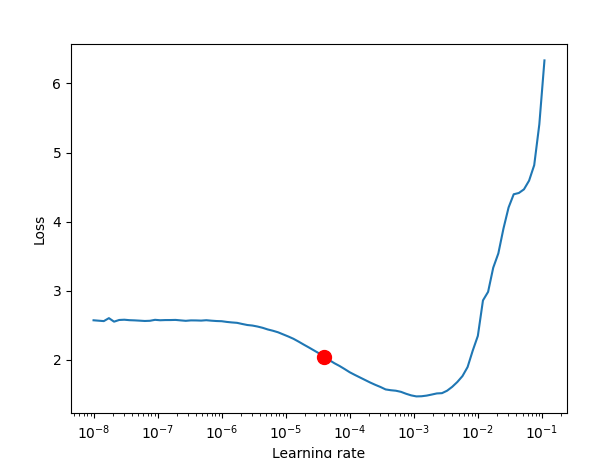

## Some Code-notes

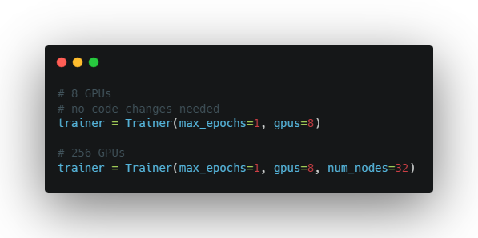

you can also write trainer = Trainer(accelerator="auto") mode, where it can find the system you're on and select the appropriate Accelerator.

 

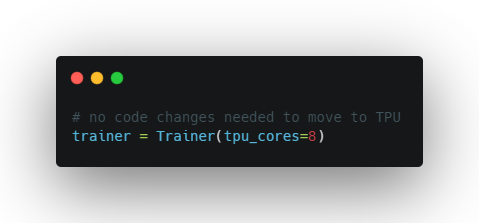

 

Accumulated gradients run K small batches of size N before doing a backward pass. The effect is a large effective batch size of size KxN.

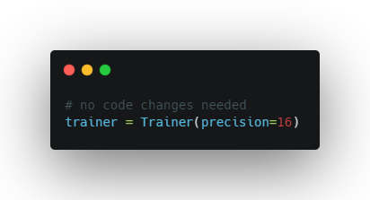

 

 

Stochastic Weight Averaging (SWA) can make your models generalize better at virtually no additional cost. This can be used with both non-trained and trained models. The SWA procedure smooths the loss landscape thus making it harder to end up in a local minimum during optimization.

For a more detailed explanation of SWA and how it works, read [this post](https://pytorch.org/blog/pytorch-1.6-now-includes-stochastic-weight-averaging) by the PyTorch team.

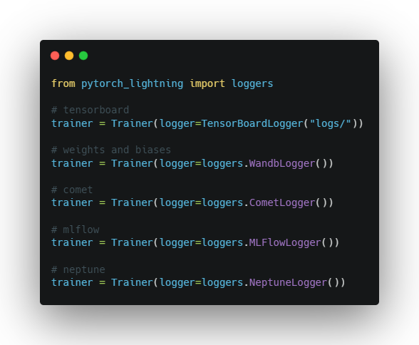

 

Auto-scaling of batch size may be enabled to find the largest batch size that fits into memory.

 

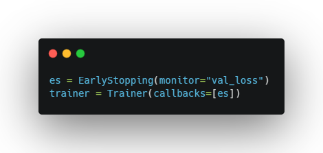

 

 

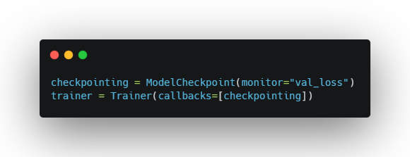

 

*Trainer(gpus=1, precision="bf16") is also available*

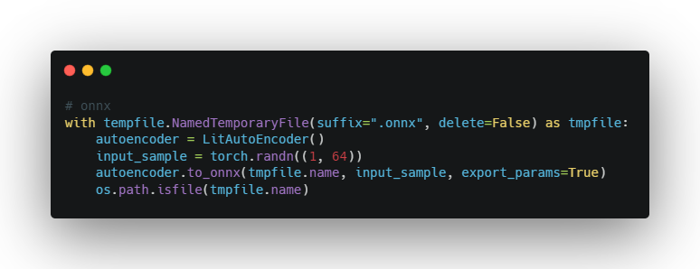

[WANDB Links to an external site.](https://docs.wandb.ai/guides/integrations/lightning)and others.

 

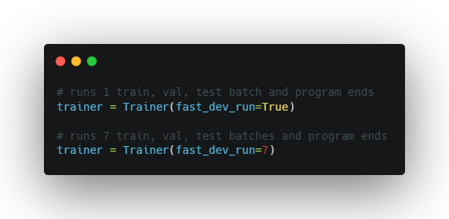

The [`EarlyStopping`Links to an external site.](https://pytorch-lightning.readthedocs.io/en/latest/api/pytorch_lightning.callbacks.early_stopping.html#pytorch_lightning.callbacks.early_stopping.EarlyStopping) callback can be used to monitor a validation metric and stop the training when no improvement is observed.

To enable it:

- Import [`EarlyStopping`Links to an external site.](https://pytorch-lightning.readthedocs.io/en/latest/api/pytorch_lightning.callbacks.early_stopping.html#pytorch_lightning.callbacks.early_stopping.EarlyStopping) callback.
- Log the metric you want to monitor using [`log()`Links to an external site.](https://pytorch-lightning.readthedocs.io/en/latest/api/pytorch_lightning.core.lightning.html#pytorch_lightning.core.lightning.LightningModule.log) method.
- Init the callback, and set monitor to the logged metric of your choice.
- Pass the [`EarlyStopping`Links to an external site.](https://pytorch-lightning.readthedocs.io/en/latest/api/pytorch_lightning.callbacks.early_stopping.html#pytorch_lightning.callbacks.early_stopping.EarlyStopping) callback to the [`Trainer`Links to an external site.](https://pytorch-lightning.readthedocs.io/en/latest/api/pytorch_lightning.trainer.trainer.html#pytorch_lightning.trainer.trainer.Trainer) callbacks flag.

 

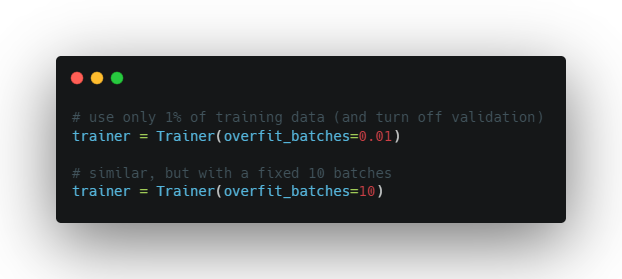

 

 

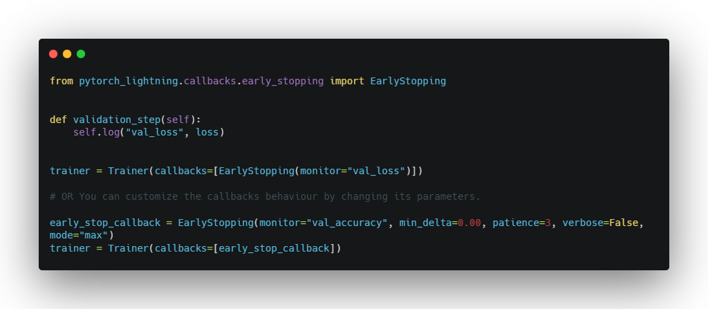

 

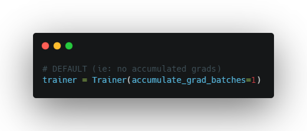

 

 

 

This flag runs a “unit test” by running n if set to `n` (int) else 1 if set to `True` training and validation batch(es). The point is to detect any bugs in the training/validation loop without having to wait for a full epoch to crash.

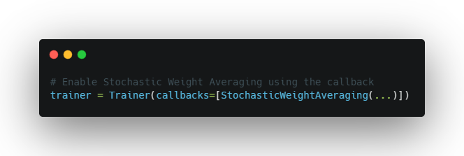

 

A good debugging technique is to take a tiny portion of your data (say 2 samples per class), and try to get your model to overfit. If it can’t, it’s a sign it won’t work with large datasets.

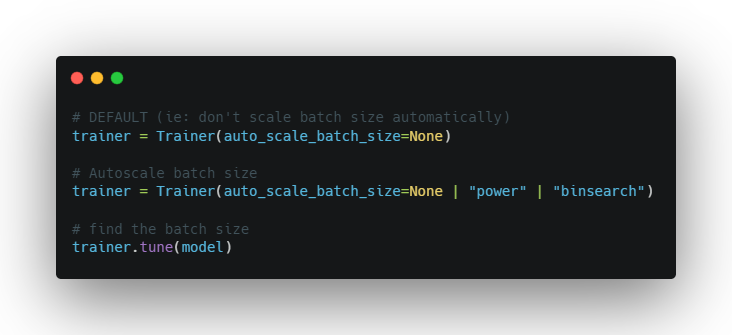
